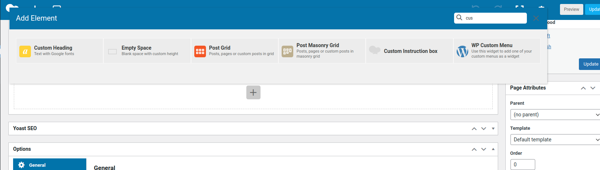

# Custom Instruction Box ( Image and Editor) for WPBakery Page Builder

This custom instruction box element for WPBakery Page Builder includes a rich text area for content and an option to select an image as an icon. The element also defines a shortcode to render the instruction box on the frontend.

## Installation

To add this custom element to your WPBakery Page Builder, add the following code to your theme's `functions.php` file or create a custom plugin.
## Select Element : Custom Instruction Box

## Add Content And Image


## Code
```
/***
 * Create wp bakery - Custom INstruction Box with wp editor
 */
if (function_exists('vc_map')) {
  vc_map(array(
      "name" => "Custom Instruction box",
      "base" => "custom_instruction_element",
      "category" => "My Elements",
      "params" => array(
          array(
              "type" => "textarea_html",
              "heading" => "Text",
              "param_name" => "content",
              "value" => "",
              "description" => "Enter the text for your button.",
          ),
          array(
              'type' => 'attach_image', // Use 'attach_image' type for selecting an image
              'heading' => __('Icon', 'text-domain'),
              'param_name' => 'icon',
              'description' => __('Select icon image.', 'text-domain')
          ),
      ),
  ));
}

```

### Using `vc_map` in WPBakery Page Builder

- **Purpose**: Register and define custom elements (shortcodes) for WPBakery Page Builder.

- **Function**: `vc_map` allows developers to:
  - Register custom elements with names, shortcode bases, and categories.
  - Define parameters (fields) like text fields, HTML text areas, and image selectors.
  - Integrate these elements into WPBakery Page Builder’s drag-and-drop interface.
  
## Parameters (`params`) in `vc_map`

- **Definition**: `params` are essential for configuring custom elements (shortcodes) in WPBakery Page Builder (`vc_map`).

- **Types**: Includes:
  - `textfield`: Simple text input field.
  - `textarea_html`: Rich text editor for HTML content.
  - `attach_image`: Image selector for choosing an image.

- **Usage**: Allows users to customize elements by filling out these fields directly within WPBakery Page Builder.

- **Example**:

## Define the Element's Output

Finally, you'll need to create the function that generates the output of your custom element based on the defined parameters. 
This function should be hooked into the "shortcode" filter and should return the HTML output of your element. Here's a simplified example:

```
add_shortcode('custom_instruction_element', 'custom_instruction_element_output');

function custom_instruction_element_output($atts, $content = null) {
    $atts = shortcode_atts(array(
        'icon' => '',
    ), $atts, 'custom_instruction_element');

    $icon_html = '';
    if (!empty($atts['icon'])) {
        $icon_url = wp_get_attachment_image_src($atts['icon'], 'full');
        if ($icon_url) {
            $icon_html = '';
        }
    }
   $output = '<div class="instruction-box">';
    if ($icon_html) {
        $output .= '<div class="instruction-icon custom_instruction_element_icon">' . $icon_html . '</div>';
    }
    
    $output .= '<div class="instruction-content custom-element-content">' . wp_kses_post($content) . '</div>';
    $output .= '</div>';

    return $output;
}

```


## Frontend Result


