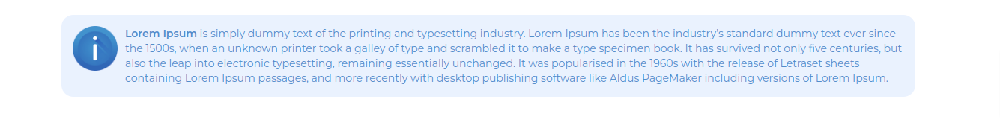

# Custom Instruction Box ( Image and Editor) for WPBakery Page Builder

This custom instruction box element for WPBakery Page Builder includes a rich text area for content and an option to select an image as an icon. The element also defines a shortcode to render the instruction box on the frontend.

## Installation

To add this custom element to your WPBakery Page Builder, add the following code to your theme's `functions.php` file or create a custom plugin.
## Select Element : Custom Instruction Box

## Add Content And Image

## Code

## Frontend View

